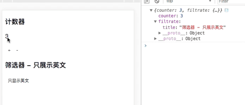

# redux

ps：每个案例都是接着上一个案例写的

主要以案例讲解如何使用，具体概念请参考如下：

[基本概念参考1](http://www.ruanyifeng.com/blog/2016/09/redux_tutorial_part_one_basic_usages.html)

[基本概念参考2](http://www.redux.org.cn/docs/basics/)


[案例源码戳这里](https://github.com/sakurayeah/reduxDemo)

<br>

-----

<br>


## 一、Store、Action、Reducer简介

Store 就是保存数据的地方，你可以把它看成一个容器。整个应用只能有一个 Store。

Action 描述当前发生的事情。改变 State 的唯一办法，就是使用 Action。它会运送数据到 Store。

Reducers 指定了应用状态的变化如何响应 actions 并发送到 store 的

action 描述“发生了什么”，使用 reducers 来根据 action 更新 state，Store 就是把它们联系到一起的对象

Store 有以下职责：

- 维持应用的 state；
- 提供 getState() 方法获取 state；
- 提供 dispatch(action) 方法更新 state；
- 通过 subscribe(listener) 注册监听器;
- 通过 subscribe(listener) 返回的函数注销监听器。

<br>

------

<br>

### 案例1 计数器

新建项目如下
```
[demo]
  |-- webpack.config.js
  |-- package.json
  |-- proxy.config.js
  |-- index.html
  |-- src
    |-- entry.js
    |-- components
      |-- counter.js
```

<font color="deeppink">demo/package.json</font>
```json
{
  "name": "demo",
  "version": "1.0.0",
  "description": "",
  "entry": {
    "index": "./src/entry.js"
  },
  "scripts": {
    "dev": "dora --plugins webpack,proxy",
    "build": "atool-build"
  },
  "author": "",
  "license": "ISC",
  "devDependencies": {
    "atool-build": "^1.0.2",
    "babel-cli": "^6.26.0",
    "babel-preset-es2015": "^6.24.1",
    "babel-preset-react": "^6.24.1",
    "babel-preset-stage-0": "^6.24.1",
    "dora": "^0.5.0",
    "dora-plugin-proxy": "^0.8.5",
    "dora-plugin-webpack": "^1.0.0",
    "react": "^16.2.0",
    "react-dom": "^16.2.0"
  },
  "dependencies": {
    "react-redux": "^5.0.7",
    "redux": "^3.7.2",
    "redux-thunk": "^2.2.0"
  }
}
```

<font color="deeppink">demo/webpack.config.js</font>
```js
var webpack = require('atool-build/lib/webpack');

module.exports = function(webpackConfig) {
  // common
  webpackConfig.plugins.some(function(plugin, i){
    if(plugin instanceof webpack.optimize.CommonsChunkPlugin || plugin.constructor.name === 'CommonsChunkPlugin') {
      webpackConfig.plugins.splice(i, 1);
      return true;
    }
  });

  // 返回 webpack 配置对象
  return webpackConfig;
};
```

<font color="deeppink">demo/index.html</font>
```html
<!DOCTYPE html>
<html lang="en">
<head>
  <meta charset="UTF-8">
  <meta name="viewport" content="width=device-width, initial-scale=1.0">
  <meta http-equiv="X-UA-Compatible" content="ie=edge">
  <title>Document</title>
</head>
<body>
  <div id="root"></div>
  <script src="./index.js"></script>
</body>
</html>
```

<font color="deeppink">demo/src/entry.js</font>
```js
import React from 'react';
import ReactDOM from 'react-dom';
import Counter from './components/counter';

ReactDOM.render(
  <Counter />,
  document.getElementById('root'),
);
```

<font color="deeppink">demo/src/component/counter.js</font>
```js
import React from 'react';

class Counter extends React.Component {
  constructor(props) {
    super(props);
    this.state = {
      num: 0,
    };
  }
  changeNum(type) {
    let {num} = this.state;
    if (type === 'ADD') {
      num += 1;
    } else {
      num -= 1;
    }
    this.setState({
      num: num
    })
  }
  render() {
    return (
      <div>
        <h3>计数器</h3>
        <p>{this.state.num}</p>
        <button onClick={() => this.changeNum('ADD')}>+</button>
        <button onClick={() => this.changeNum('SUBTRACT')}>-</button>
      </div>
    )
  }
}

export default Counter;
```

$ npm i

$ npm run dev

打开 http://localhost:8989/ ，效果如下


我们要做的效果就是这样的，这个是没有用 redux 的来实现的，下面来改造redux的写法

新增如下
```
[demo]
  |-- src
    |-- reducers
      |-- counter.js
```

<font color="deeppink">demo/src/reducers/counter.js</font>
```js
// 整个应用的初始状态，可以作为 State 的默认值
const defaultState = 0;

export default (state = defaultState, action = {}) => {
  // action 是一个对象，其中的type属性是必须的，表示 Action 的名称
  const { type, payload } = action;
  // 当 reducer 接受到不同类型的 action 时，会对 state 进行处理，返回一个新的 state 值
  switch (type) {
    case 'ADD':
      return state + 1;
    case 'SUBTRACT':
      return state -1 ;
    default: 
      return state;
  }
};
```

这里初始状态 state 的默认值为 0 ; 当接收到的 action 的 type 值为 ADD 时 , 返回的 state 值会加一 ; 当接收到的 action 的 type 值为 SUBTRACT 时 , 返回的 state 值会减一

相当于是做了这里的操作
```js
changeNum(type) {
  let {num} = this.state;
  if (type === 'ADD') {
    num += 1;
  } else {
    num -= 1;
  }
  this.setState({
    num: num
  })
}
```

state = defaultState 就相当于是做了这里的操作
```js
this.state = {
  num: 0,
};
```

<font color="deeppink">demo/src/entry.js</font>
```js
import React from 'react';
import ReactDOM from 'react-dom';
import { createStore } from 'redux';
import Counter from './components/counter';
import counterReducer from './reducers/counter';

// 通过 createStore 创建一个 Redux store 来存放应用中所有的 state , 应用中应有且仅有一个 store。
const store = createStore(counterReducer);

const render = () => {
  ReactDOM.render(
    <Counter store={store}/>,
    document.getElementById('root'),
  );
}

render();

// Store 允许使用 store.subscribe 方法设置监听函数，一旦 State 发生变化，就自动执行这个函数。
store.subscribe(render);
```

createStore 的参数：createStore(reducer, [preloadedState], enhancer)

[详细参考请戳这里](http://www.redux.org.cn/docs/api/createStore.html)

每当 state 发生变化时，通过 store.subscribe 去监听，从而实现 view 的自动渲染。当把这排代码注释掉时，点击加号和减号，view 不会发生改变。


<font color="deeppink">demo/src/component/counter.js</font>
```js
import React from 'react';

class Counter extends React.Component {
  constructor(props) {
    super(props);
  }
  render() {
    const { store } = this.props;
    return (
      <div>
        <h3>计数器</h3>
        {/* 当前时刻的 State，可以通过 store.getState() 拿到 */}
        <p>{store.getState()}</p>
        {/* store.dispatch 接受一个 Action 对象作为参数，将它发送出去 */}
        <button onClick={() => store.dispatch({type: 'ADD'})}>+</button>
        <button onClick={() => store.dispatch({type: 'SUBTRACT'})}>-</button>
      </div>
    )
  }
}

export default Counter;
```

当点击加号时，store.dispatch 接收到的 action 对象 , type 为 ADD , 触发 reducer 执行，返回新的 state (state + 1) .
```js
switch (type) {
    case 'ADD':
      return state + 1;
```

效果和上图一样


<br>

-------

<br>

## 二、Action 创建函数

Action 创建函数 就是生成 action 的方法

<br>

-------

<br>

### 案例2 筛选

新增
```
[demo]
  |-- reducers
    |-- filtrate.js
  |-- components
    |-- filtrate.js
  |-- actions
    |-- filtrate.js
```

<font color="deeppink">demo/src/reducers/filtrate.js</font>
```js
// 整个应用的初始状态，可以作为 State 的默认值
const defaultState = {
  title: '筛选器',
  list: [
    {
      language: 'EN',
      desc: 'The forest was completely silent for a moment'
    },
    {
      language: 'CN',
      desc: '量小非君子，无度不丈夫'
    },
    {
      language: 'EN',
      desc: 'In the library it was very still'
    },
    {
      language: 'EN',
      desc: 'The living room is so quiet without guests.'
    },
    {
      language: 'CN',
      desc: '擒贼先擒王'
    }
  ]
};

export default (state = defaultState, action = {}) => {
  // action 是一个对象，其中的type属性是必须的，表示 Action 的名称
  const { type, payload } = action;
  // 当 reducer 接受到不同类型的 action 时，会对 state 进行处理，返回一个新的 state 值
  switch (type) {
    case 'SHOW_EN':
      return state;
    default: 
      return state;
  }
};
```

<font color="deeppink">demo/src/components/filtrate.js</font>
```js
import React from 'react';

class Filtrate extends React.Component {
  constructor(props) {
    super(props);
  }
  render() {
    const { store } = this.props;
    const { title = '', list = [] } = store.getState();
    return (
      <div>
        <h3>{title}</h3>
        <button>只显示英文</button>
        {
          list.map((v, i) => (
            <div key={i}>{`${i+1}、${v.desc}`}</div>
          ))
        }
      </div>
    )
  }
}

export default Filtrate;
```

<font color="deeppink">demo/src/entry.js</font>
```js
import React from 'react';
import ReactDOM from 'react-dom';
import { createStore } from 'redux';
import Counter from './components/counter';
import Filtrate from './components/filtrate';
import counterReducer from './reducers/counter';
import FiltrateReducer from './reducers/filtrate';

// 通过 createStore 创建一个 Redux store 来存放应用中所有的 state , 应用中应有且仅有一个 store。
// const store = createStore(counterReducer);
const store = createStore(FiltrateReducer);

const render = () => {
  ReactDOM.render(
    <Filtrate store={store}/>,
    document.getElementById('root'),
  );
}

render();

// Store 允许使用 store.subscribe 方法设置监听函数，一旦 State 发生变化，就自动执行这个函数。
store.subscribe(render);
```

效果如下


<font color="deeppink">demo/src/actions/filtrate.js</font>
```js
export const showEn = (list) => {
  let arr = [];
  // 从数组里筛选出 language 为 'EN' 的部分
  list.map((v) => {
    if(v.language === 'EN') {
      arr.push(v)
    }
  })
  return {
    type: 'SHOW_EN',
    payload: arr,
  }
}
```

<font color="deeppink">demo/src/components/filtrate.js</font>
```js
import React from 'react';
import * as action from '../actions/filtrate';

class Filtrate extends React.Component {
  constructor(props) {
    super(props);
  }
  render() {
    const { store } = this.props;
    const { title = '', list = [] } = store.getState();
    return (
      <div>
        <h3>{title}</h3>
        <button onClick={() => store.dispatch(action.showEn(list))}>只显示英文</button>
        {
          list.map((v, i) => (
            <div key={i}>{`${i+1}、${v.desc}`}</div>
          ))
        }
      </div>
    )
  }
}

export default Filtrate;
```
案例1 里面，store.dispatch 里是直接传的对象，这里要筛选数组里属于英文的部分，定义一个函数来生成 Action，这个函数就叫 Action Creator。


<font color="deeppink">demo/src/reducers/filtrate.js</font>
```js
// 整个应用的初始状态，可以作为 State 的默认值
const defaultState = {
  title: '筛选器',
  list: [
    {
      language: 'EN',
      desc: 'The forest was completely silent for a moment'
    },
    {
      language: 'CN',
      desc: '量小非君子，无度不丈夫'
    },
    {
      language: 'EN',
      desc: 'In the library it was very still'
    },
    {
      language: 'EN',
      desc: 'The living room is so quiet without guests.'
    },
    {
      language: 'CN',
      desc: '擒贼先擒王'
    }
  ]
};

export default (state = defaultState, action = {}) => {
  // action 是一个对象，其中的type属性是必须的，表示 Action 的名称
  const { type, payload } = action;
  // 当 reducer 接受到不同类型的 action 时，会对 state 进行处理，返回一个新的 state 值
  switch (type) {
    case 'SHOW_EN':
      return {
        ...state,
        list: payload // 这里传过来的 payload 就是筛选过的数组
      };
    default: 
      return state;
  }
};
```

效果如下


<br>

-------

<br>


## 三、combineReducers

Redux 提供了一个combineReducers方法，用于 Reducer 的拆分。你只要定义各个子 Reducer 函数，然后用这个方法，将它们合成一个大的 Reducer。

<br>

-------

<br>

### 案例3

将前面 案例1 和 案例2 合并一个 reducer

新增
```
[demo]
  |-- src
    |-- components
      |-- init.js
    |-- reducers
      |-- index.js
```

<font color="deeppink">demo/src/reducers/index.js</font>
```js
import { combineReducers } from 'redux';
import counterReducer from './reducers/counter';
import filtrateReducer from './reducers/filtrate';

// 将 counterReducer 和 filtrateReducer 合并成一个大的 reducer
export default combineReducers({
  counter: counterReducer,
  filtrate: filtrateReducer
})
```

<font color="deeppink">demo/src/entry.js</font>
```js
import React from 'react';
import ReactDOM from 'react-dom';
import { createStore } from 'redux';
import Counter from './components/counter';
import Filtrate from './components/filtrate';
import reducer from './reducers/index';

// 通过 createStore 创建一个 Redux store 来存放应用中所有的 state , 应用中应有且仅有一个 store。
// const store = createStore(counterReducer);
const store = createStore(reducer);

const render = () => {
  ReactDOM.render(
    <Filtrate store={store}/>,
    document.getElementById('root'),
  );
}

render();

// Store 允许使用 store.subscribe 方法设置监听函数，一旦 State 发生变化，就自动执行这个函数。
store.subscribe(render);
```

<font color="deeppink">demo/src/components/filtrate.js</font>
```js
import React from 'react';
import * as action from '../actions/filtrate';

class Filtrate extends React.Component {
  constructor(props) {
    super(props);
  }
  render() {
    const { store } = this.props;
    const { title = '', list = [] } = store.getState().filtrate;
    return (
      <div>
        <h3>{title}</h3>
        <button onClick={() => store.dispatch(action.showEn(list))}>只显示英文</button>
        {
          list.map((v, i) => (
            <div key={i}>{`${i+1}、${v.desc}`}</div>
          ))
        }
      </div>
    )
  }
}

export default Filtrate;
```

这里 store.getState() 获取的包含了 counter 和 filtrate 两部分的，因此要取 filtrate 部分的，就要用 store.getState().filtrate

改到这里，看到的效果和 案例2 一样

下面再把 counter 也加入

<font color="deeppink">demo/src/entry.js</font>
```js
import React from 'react';
import ReactDOM from 'react-dom';
import { createStore } from 'redux';
import reducer from './reducers/index';
import Init from './components/init';

// 通过 createStore 创建一个 Redux store 来存放应用中所有的 state , 应用中应有且仅有一个 store。
const store = createStore(reducer);

const render = () => {
  ReactDOM.render(
    <Init store={store}/>,
    document.getElementById('root'),
  );
}

render();

// Store 允许使用 store.subscribe 方法设置监听函数，一旦 State 发生变化，就自动执行这个函数。
store.subscribe(render);
```

<font color="deeppink">demo/components/index.js</font>
```js
import React from 'react';
import Filtrate from './filtrate';
import Counter from './counter';

class Init extends React.Component {
  constructor(props) {
    super(props);
  }
  render() {
    const { store } = this.props;
    return (
      <div>
        <Counter store={store} />
        <Filtrate store={store} />
      </div>
    )
  }
}

export default Init;
```

<font color="deeppink">demo/components/counter.js</font>
```js
import React from 'react';

class Counter extends React.Component {
  constructor(props) {
    super(props);
  }
  render() {
    const { store } = this.props;
    return (
      <div>
        <h3>计数器</h3>
        {/* 当前时刻的 State，可以通过 store.getState() 拿到 */}
        <p>{store.getState().counter}</p>
        {/* store.dispatch 接受一个 Action 对象作为参数，将它发送出去 */}
        <button onClick={() => store.dispatch({type: 'ADD'})}>+</button>
        <button onClick={() => store.dispatch({type: 'SUBTRACT'})}>-</button>
      </div>
    )
  }
}

export default Counter;
```

效果如下


多个 action 的写法如下（这里不单独写案例了，大家自己尝试下）
```
|-- actions
  |-- a.js
  |-- filtrate.js
  |-- index.js

index.js 内容如下
```

```js
import * as aAction from './a';
import * as filtrateAction from './filtrate';

export default {
  ...aAction,
  ...filtrateAction,
}
```

在 demo/src/components/filtrate.js 里
```js
import * as action from '../actions/filtrate';
```

就应该写成
```js
import action from '../actions/index';
```


<br>

-------

<br>


## 四、初始化 State

上面介绍了 createStore 的三个参数：createStore(reducer, [preloadedState], enhancer)，并且介绍了 reducer 怎么用。下面来介绍下 preloadedState

主要有两种方法来初始化应用的 state ，第一种是在 reducer 中为 state 设置默认值，第二种是用 createStore 方法中的第二个参数 preloadedState。

第一个方法在 案例1 已经展示过怎么写了
```js
// 案例1 demo/src/reducers/counter.js
// 整个应用的初始状态，可以作为 State 的默认值
const defaultState = 0;
export default (state = defaultState, action = {}) => {}
```

下面介绍第二个方法的使用

<br>

-------

<br>

## 案例4

<font color="deeppink">demo/src/entry.js</font>
```js
import React from 'react';
import ReactDOM from 'react-dom';
import { createStore } from 'redux';
import reducer from './reducers/index';
import Init from './components/init';

// 通过 createStore 创建一个 Redux store 来存放应用中所有的 state , 应用中应有且仅有一个 store。
const store = createStore(reducer);

console.log(store.getState())

const render = () => {
  ReactDOM.render(
    <Init store={store}/>,
    document.getElementById('root'),
  );
}

render();

// Store 允许使用 store.subscribe 方法设置监听函数，一旦 State 发生变化，就自动执行这个函数。
store.subscribe(render);
```

console 打印的结果如下所示


<font color="deeppink">demo/src/entry.js</font>
```js
import React from 'react';
import ReactDOM from 'react-dom';
import { createStore } from 'redux';
import reducer from './reducers/index';
import Init from './components/init';

// 通过 createStore 创建一个 Redux store 来存放应用中所有的 state , 应用中应有且仅有一个 store。
const store = createStore(reducer, {
  counter: 3,
  filtrate: {
    title: '筛选器 - 只展示英文'
  }
});

console.log(store.getState())

const render = () => {
  ReactDOM.render(
    <Init store={store}/>,
    document.getElementById('root'),
  );
}

render();

// Store 允许使用 store.subscribe 方法设置监听函数，一旦 State 发生变化，就自动执行这个函数。
store.subscribe(render);
```

刷新页面后，效果如下



这时，默认值就不是 reducer 里设置的了，而是 preloadedState。

这里要注意的时，使用 combineReducers 结合多个 reducer 使用时，设置的初始值一定要和 combineReducers 里的 key 对应。

例如，直接写一个 abc 在里面
```js
const store = createStore(reducer, {
  counter: 3,
  filtrate: {
    title: '筛选器 - 只展示英文',
  },
  abc: 123
});
```
则会报错

```
warning.js:14 Unexpected key "abc" found in preloadedState argument passed to createStore. Expected to find one of the known reducer keys instead: "counter", "filtrate". Unexpected keys will be ignored.
```

总结：

通常情况下，通过 preloadedState 指定的 state 要优先于通过 reducer 指定 state。这样可以使通过 reducer 默认参数指定初始数据显得更加的合理，并且当你从一些持久化的存储器或服务器更新 store 的时候，允许你更新已存在的数据（全部或者部分）。

preloadedState 但是如果你不传任何东西，或者没设置相应的字段，那么 reducer 就会选择指定的默认 state 参数来取代


<br>

-------

<br>


## 五、connect

React-Redux 将所有组件分成两大类：UI 组件（presentational component）和容器组件（container component）。

UI 组件有以下几个特征：
- 只负责 UI 的呈现，不带有任何业务逻辑
- 没有状态（即不使用this.state这个变量）
- 所有数据都由参数（this.props）提供
- 不使用任何 Redux 的 API

容器组件的特征恰恰相反：
- 负责管理数据和业务逻辑，不负责 UI 的呈现
- 带有内部状态
- 使用 Redux 的 API

UI 组件负责 UI 的呈现，容器组件负责管理数据和逻辑。

[详细参考请戳这里](http://www.ruanyifeng.com/blog/2016/09/redux_tutorial_part_three_react-redux.html)


React-Redux 提供 connect 方法，用于从 UI 组件生成容器组件。connect 的意思，就是将这两种组件连起来。

写法如下
```js
import { connect } from 'react-redux'

class Filtrate extends React.Component {
  ...
};

export default connect(
  mapStateToProps,
  mapDispatchToProps
)(Filtrate)
```

connect方法接受两个参数：mapStateToProps和mapDispatchToProps。它们定义了 UI 组件的业务逻辑。前者负责输入逻辑，即将state映射到 UI 组件的参数（props），后者负责输出逻辑，即将用户对 UI 组件的操作映射成 Action。


<br>

-------

<br>


## 六、mapStateToProps

mapStateToProps(Function): 如果定义该参数，组件将会监听 Redux store 的变化。任何时候，只要 Redux store 发生改变，mapStateToProps 函数就会被调用。该回调函数必须返回一个纯对象，这个对象会与组件的 props 合并。如果你省略了这个参数，你的组件将不会监听 Redux store。

<br>

-------

<br>


### 案例5

<font color="deeppink">demo/src/entry.js</font>
```js
import React from 'react';
import ReactDOM from 'react-dom';
import { createStore } from 'redux';
import reducer from './reducers/index';
import Init from './components/init';

// 通过 createStore 创建一个 Redux store 来存放应用中所有的 state , 应用中应有且仅有一个 store。
const store = createStore(reducer);

const render = () => {
  ReactDOM.render(
    <Init store={store}/>,
    document.getElementById('root'),
  );
}

render();

// Store 允许使用 store.subscribe 方法设置监听函数，一旦 State 发生变化，就自动执行这个函数。
store.subscribe(render);
```

<font color="deeppink">demo/src/components/filtrate.js</font>
```js
import React from 'react';
import { connect } from 'react-redux'
import * as action from '../actions/filtrate';

class Filtrate extends React.Component {
  constructor(props) {
    super(props);
  }
  render() {
    const { filtrate, dispatch } = this.props;
    const { title = '', list = [] } = filtrate;
    return (
      <div>
        <h3>{title}</h3>
        <button onClick={() => dispatch(action.showEn(list))}>只显示英文</button>
        {
          list.map((v, i) => (
            <div key={i}>{`${i+1}、${v.desc}`}</div>
          ))
        }
      </div>
    )
  }
}

const mapStateToProps = (state) => {
  // 这里的 state 就相当于是上面案例里写的 store.getState()，在这个案例里
  // mapStateToProps 这个回调函数返回的对象，相当于是 store.getState().filtrate
  return {
    filtrate: state.filtrate
  }
}
// mapStateToProps 函数返回的对象 和组件 Filtrate 的 props 合并后，可以直接通过 this.props.filtrate 取出
export default connect(mapStateToProps)(Filtrate);
```

效果和 案例3 一样

mapStateToProps 会订阅 Store，每当 state 更新的时候，就会自动执行，重新计算 UI 组件的参数，从而触发 UI 组件的重新渲染。

connect 方法可以省略 mapStateToProps 参数，那样的话，UI 组件就不会订阅Store，就是说 Store 的更新不会引起 UI 组件的更新。

可以尝试下 改为下面这样，就会发现点击“只显示英文”的按钮时，不会有变化
```js
// export default connect(mapStateToProps)(Filtrate);
export default connect()(Filtrate);
```

mapStateToProps的第一个参数总是state对象，还可以使用第二个参数，代表容器组件的props对象。

```js
// ownProps 可以理解为：mapStateToProps 函数返回的对象 和组件 Filtrate 的 props 合并之前，组件自身的 props。这里的 ownProps，就相当于是 案例3 Filtrate 组件的 this.props。
const mapStateToProps = (state, ownProps) => {
  console.log(ownProps)
  return {
    filtrate: state.filtrate
  }
}
```

<br>

-------

<br>


## 七、mapDispatchToProps

mapDispatchToProps：Object | Function
- Object：如果传递的是一个对象，那么每个定义在该对象的函数都将被当作 Redux action creator，对象所定义的方法名将作为属性名
- Function：每个方法将返回一个新的函数，函数中 dispatch 方法会将 action creator 的返回值作为参数执行。这些属性会被合并到组件的 props 中。

<br>

-------

<br>


### 案例6

<font color="deeppink">demo/src/components/filtrate.js</font>
```js
import React from 'react';
import { connect } from 'react-redux'
import * as action from '../actions/filtrate';

class Filtrate extends React.Component {
  constructor(props) {
    super(props);
  }
  render() {
    const { filtrate, btnClick } = this.props;
    const { title = '', list = [] } = filtrate;
    return (
      <div>
        <h3>{title}</h3>
        <button onClick={() => btnClick(list)}>只显示英文</button>
        {
          list.map((v, i) => (
            <div key={i}>{`${i+1}、${v.desc}`}</div>
          ))
        }
      </div>
    )
  }
}

const mapStateToProps = (state, ownProps) => {
  return {
    filtrate: state.filtrate
  }
}

// 这里 mapDispatchToProps 是一个函数，有两个参数 dispatch 和 ownProps（容器组件的props对象
const mapDispatchToProps = (dispatch, ownProps) => {
  // 返回一个对象，该对象的每个键值对都是一个映射，定义了 UI 组件的参数怎样发出 Action
  return {
    btnClick: (list) => {
      dispatch(action.showEn(list))
    }
  }
}

// 这里是 mapDispatchToProps 为对象的写法
// const mapDispatchToProps = {
//   btnClick: (list) => action.showEn(list),
// }

export default connect(mapStateToProps, mapDispatchToProps)(Filtrate);
```

mapDispatchToProps 是 connect 函数的第二个参数，用来建立 UI 组件的参数到store.dispatch方法的映射。也就是说，它定义了哪些用户的操作应该当作 Action，传给 Store。它可以是一个函数，也可以是一个对象。


<br>

-------

<br>


## 八、Provider

Provider 使组件层级中的 connect() 方法都能够获得 Redux store。正常情况下，你的根组件应该嵌套在 Provider 中才能使用 connect() 方法。

案例6 中，是把 store 作为 props 传递到每一个被 connect() 包装的组件

但是 redux 只推荐在单元测试中对 store 进行伪造 (stub) 或者在非完全基于 React 的代码中才这样做。正常情况下，应该使用 Provider


<br>

-------

<br>


### 案例7

<font color="deeppink">demo/src/entry.js</font>
```js
import React from 'react';
import ReactDOM from 'react-dom';
import { createStore } from 'redux';
import { Provider } from 'react-redux'
import reducer from './reducers/index';
import Init from './components/init';

const store = createStore(reducer);

// Provider 在根组件外面包了一层，这样一来，Init 的所有子组件就默认都可以拿到state 了
ReactDOM.render(
  <Provider store={store}>
    <Init />
  </Provider>,
  document.getElementById('root'),
);
```

<font color="deeppink">demo/src/components/init.js</font>
```js
import React from 'react';
import Filtrate from './filtrate';
import Counter from './counter';

class Init extends React.Component {
  constructor(props) {
    super(props);
  }
  render() {
    const { store } = this.props;
    return (
      <div>
        <Counter />
        <Filtrate />
      </div>
    )
  }
}

export default Init;
```

<font color="deeppink">demo/src/components/counter.js</font>
```js
import React from 'react';
import { connect } from 'react-redux';

class Counter extends React.Component {
  constructor(props) {
    super(props);
  }
  render() {
    const { counter, addClick, subtractClick } = this.props;
    return (
      <div>
        <h3>计数器</h3>
        <p>{counter}</p>
        <button onClick={() => addClick()}>+</button>
        <button onClick={() => subtractClick()}>-</button>
      </div>
    )
  }
}

const mapStateToProps = (state, ownProps) => {
  return {
    counter: state.counter
  }
}

// function 写法
const mapDispatchToProps = (dispatch, ownProps) => {
  return {
    addClick: () => {
      dispatch({type: 'ADD'})
    },
    subtractClick: () => {
      dispatch({type: 'SUBTRACT'})
    }
  }
}


// 对象 写法
// const mapDispatchToProps = {
//   addClick: () => ({
//     type: 'ADD'
//   }),
//   subtractClick: () => ({
//     type: 'SUBTRACT'
//   })
// }

export default connect(mapStateToProps, mapDispatchToProps)(Counter);
```

效果和 案例3 一样。


<br>

-------

<br>


## 九、bindActionCreators

bindActionCreators(actionCreators, dispatch)

把一个 value 为不同 action creator 的对象，转成拥有同名 key 的对象。同时使用 dispatch 对每个 action creator 进行包装，以便可以直接调用它们。

参数
- actionCreators (Function or Object): 一个 action creator，或者一个 value 是 action creator 的对象。
- dispatch (Function): 一个由 Store 实例提供的 dispatch 函数。


<br>

-------

<br>


### 案例8

```js
import React from 'react';
import { bindActionCreators } from 'redux';
import { connect } from 'react-redux';
import * as action from '../actions/filtrate';

class Filtrate extends React.Component {
  constructor(props) {
    super(props);
  }
  render() {
    const { filtrate, btnClick, actions } = this.props;
    const { title = '', list = [] } = filtrate;
    return (
      <div>
        <h3>{title}</h3>
        <button onClick={() => actions.showEn(list)}>只显示英文</button>
        {
          list.map((v, i) => (
            <div key={i}>{`${i+1}、${v.desc}`}</div>
          ))
        }
      </div>
    )
  }
}

const mapStateToProps = (state, ownProps) => {
  return {
    filtrate: state.filtrate
  }
}

function mapDispatchToProps(dispatch, ownProps) {
  // 返回值(Function or Object): 一个与原对象类似的对象，只不过这个对象的 value 都是会直接 dispatch 原 action creator 返回的结果的函数。如果传入一个单独的函数作为 actionCreators，那么返回的结果也是一个单独的函数。
  return {
    actions: bindActionCreators(action, dispatch)
  }
};

export default connect(mapStateToProps, mapDispatchToProps)(Filtrate);
```

效果和 案例3 一样。


<br>

-------

<br>


## 十、applyMiddleware

是 Redux 的原生方法，作用是将所有中间件组成一个数组，依次执行

中间件就是一个函数，对store.dispatch方法进行了改造，在发出 Action 和执行 Reducer 这两步之间，添加了其他功能。

注意点：

（1）createStore方法可以接受整个应用的初始状态作为参数，那样的话，applyMiddleware就是第三个参数了。

```js
const store = createStore(
  reducer,
  preloadedState,
  applyMiddleware(logger)
);
```

（2）中间件的次序有讲究。

```js
const store = createStore(
  reducer,
  applyMiddleware(thunk, promise, logger)
);
```

[详细概念戳这里](http://www.ruanyifeng.com/blog/2016/09/redux_tutorial_part_two_async_operations.html)


<br>

-------

<br>

## 十一、redux-thunk 中间键

redux-thunk 中间件可以让 action 创建函数先不返回一个 action 对象，而是返回一个函数，函数传递两个参数(dispatch,getState), 在函数体内进行业务逻辑的封装


<br>

-------

<br>


### 案例9

npm i jquery --save

mock数据内容如下

<font>demo/proxy.config.js</font>
```js
module.exports = {
  'GET /filtrateInit.json': {
    list: [
      {
        language: 'EN',
        desc: 'The forest was completely silent for a moment'
      },
      {
        language: 'CN',
        desc: '量小非君子，无度不丈夫'
      },
      {
        language: 'EN',
        desc: 'In the library it was very still'
      },
      {
        language: 'EN',
        desc: 'The living room is so quiet without guests.'
      },
      {
        language: 'CN',
        desc: '擒贼先擒王'
      }
    ]
  }
}
```

<font color="deeppink">demo/src/entry.js</font>
```js
import React from 'react';
import ReactDOM from 'react-dom';
import { createStore, applyMiddleware } from 'redux';
import { Provider } from 'react-redux'
import thunk from 'redux-thunk';
import reducer from './reducers/index';
import Init from './components/init';

const store = createStore(reducer, applyMiddleware(thunk));

ReactDOM.render(
  <Provider store={store}>
    <Init />
  </Provider>,
  document.getElementById('root'),
);
```

<font>demo/src/actions/filtrate.js</font>
```js
import $ from 'jquery';

// 只展示英文
export const showEn = (list) => {
  let arr = [];
  list.map((v) => {
    if(v.language === 'EN') {
      arr.push(v)
    }
  })
  return {
    type: 'BUILD_LIST',
    payload: arr,
  }
}

// 初始化请求
export const filtrateInit = () => (dispatch, getState) => {
  $.ajax({
    url: 'filtrateInit.json',
    success: (data = {}) => {
      dispatch(filtrateInitOK(data))
    },
    error: () => {
      // 请求失败的处理
    }
  })
}

// 请求成功处理
export const filtrateInitOK = (data) => {
  const { list } = data;
  return {
    type: 'BUILD_LIST',
    payload: list,
  }
}
```

<font>demo/src/reducers/filtrate.js</font>
```js
// 整个应用的初始状态，可以作为 State 的默认值
const defaultState = {
  title: '筛选器',
  list: []
};

export default (state = defaultState, action = {}) => {
  // action 是一个对象，其中的type属性是必须的，表示 Action 的名称
  const { type, payload } = action;
  // 当 reducer 接受到不同类型的 action 时，会对 state 进行处理，返回一个新的 state 值
  switch (type) {
    case 'BUILD_LIST':
      return {
        ...state,
        list: payload
      };
    default: 
      return state;
  }
};
```

<font>demo/src/components/filtrate.js</font>
```js
import React from 'react';
import { bindActionCreators } from 'redux';
import { connect } from 'react-redux';
import * as action from '../actions/filtrate';

class Filtrate extends React.Component {
  constructor(props) {
    super(props);
  }
  componentDidMount() {
    const { actions } = this.props;
    // 初始化请求拿 list 的内容
    actions.filtrateInit();
  }
  render() {
    const { filtrate, btnClick, actions } = this.props;
    const { title = '', list = [] } = filtrate;
    return (
      <div>
        <h3>{title}</h3>
        <button onClick={() => actions.showEn(list)}>只显示英文</button>
        {
          list.map((v, i) => (
            <div key={i}>{`${i+1}、${v.desc}`}</div>
          ))
        }
      </div>
    )
  }
}

const mapStateToProps = (state, ownProps) => {
  return {
    filtrate: state.filtrate
  }
}

function mapDispatchToProps(dispatch, ownProps) {
  // 返回值(Function or Object): 一个与原对象类似的对象，只不过这个对象的 value 都是会直接 dispatch 原 action creator 返回的结果的函数。如果传入一个单独的函数作为 actionCreators，那么返回的结果也是一个单独的函数。
  return {
    actions: bindActionCreators(action, dispatch)
  }
};

export default connect(mapStateToProps, mapDispatchToProps)(Filtrate);
```


<br>

-------

<br>


## 十一
### 案例9